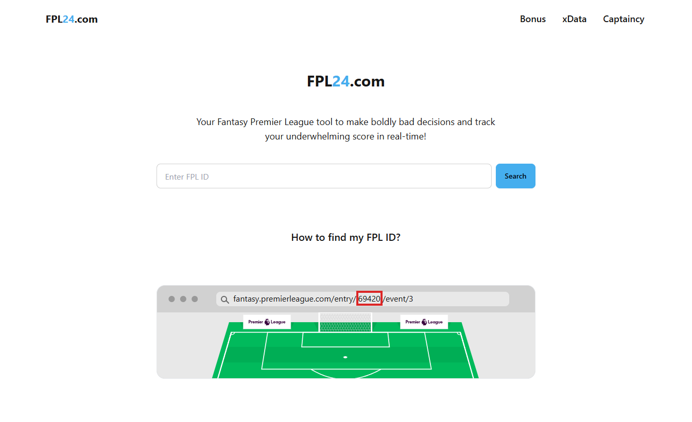

# FPL24.com

This is a [Next.js](https://nextjs.org) project bootstrapped with [`create-next-app`](https://nextjs.org/docs/app/api-reference/cli/create-next-app).

## Technologies Used

- 
- 
- 
- 

## Features

- **Live Updates**: Get real-time updates on your gameweek score.
- **Transfers**: Keep track of transfers made.
- **Data**: Get expected data on the top performing players of the season.
- **Fixtures and Bonus**: See the Gameweek scores in real-time and what the bps standings are for each game.
- **Captaincy Picker**: A wheel that will help you choose your captain for the gameweek.

